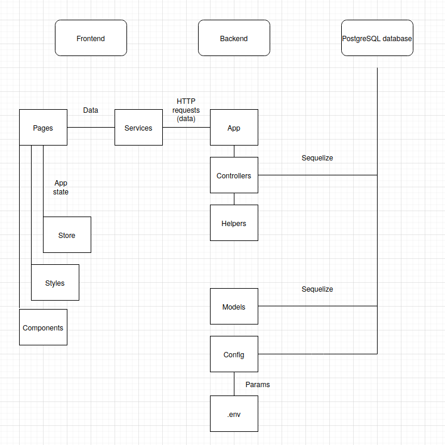

# Architecture

This application consists of three key components: Frontend, backend and a PostgreSQL database.

Frontend uses React and NextJS to provide a user interface to the application.
- Files in /pages have associated routes generated automatically
- Pages combine components and styling from /styles to create individual views, with the exeption of /survey/questions/index.jsx. It's content changes dynamically to provide the whole survey-section of the app.
- Services abstract connections to Backend. Axios is used to exchange data with Backend via HTTP.
- Store uses Zustand to save app state to local storage.

Backend uses Express to provide endpoints for frontend and Sequelize to interact with the database.
- Controllers receive requests and provide associated functionalities
- Helpers assist controllers with complex tasks
- Models and Config initialize and structure the database
- secrets are passed with the environment, for example with a .env-file.

During development a local PostgreSQL-database is used to store data.
In production, a similar database is used in Heroku.

## Communication between components

Communication between Frontend and Backend is done via HTTP-requests.
Backend interacts with the database with the assistance of Sequelize-library.

Communication in typical use-cases is described in the following sequence diagram.
NOTE: For brevity, only key traffic between frontend and store are described. Some details of backend-database requests are omitted for the same reason.

[Survey and summary](https://github.com/Devops-ohtuprojekti/DevOpsCSAOS/blob/documentation/documentation/assets/DevOps%20CSAOS%20sequences.jpg)

[Results and detailed results](https://github.com/Devops-ohtuprojekti/DevOpsCSAOS/blob/documentation/documentation/assets/DevOps%20CSAOS%20sequences%202.jpg)

## Backend API

Backend API [can be found here](https://github.com/Devops-ohtuprojekti/DevOpsCSAOS/blob/documentation/documentation/backend-api.md)

## Dependencies and external APIs

Library dependencies are found in each app's package.json-files.

External APIs:

Social media APIs are accessed with the help of react-share-library. It's documentation can be found at [project's site](https://www.npmjs.com/package/react-share)

Hubspot is accessed with it's own Client API It's details can be inspected in [their documentation](https://developers.hubspot.com/docs/api/overview).

## Choices and commentary

NextJS was taken onto the project in early phases of the development in hopes of useful functionalities. It's router is being used in the project, but the key
advantage, serverside rendering is *not* used currently. Thus the team is rather uncertain if any real functional advantage was gained by using NextJS.
