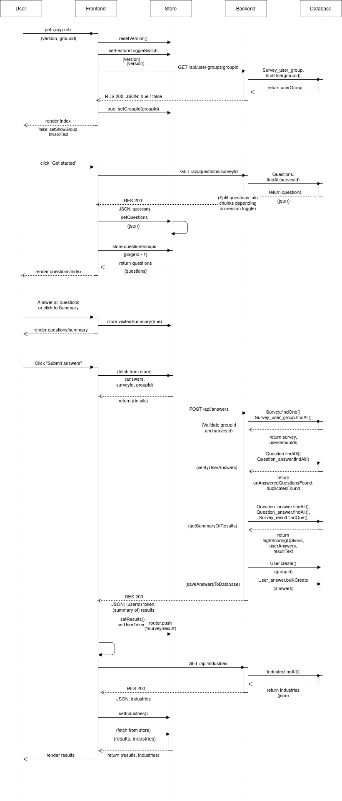
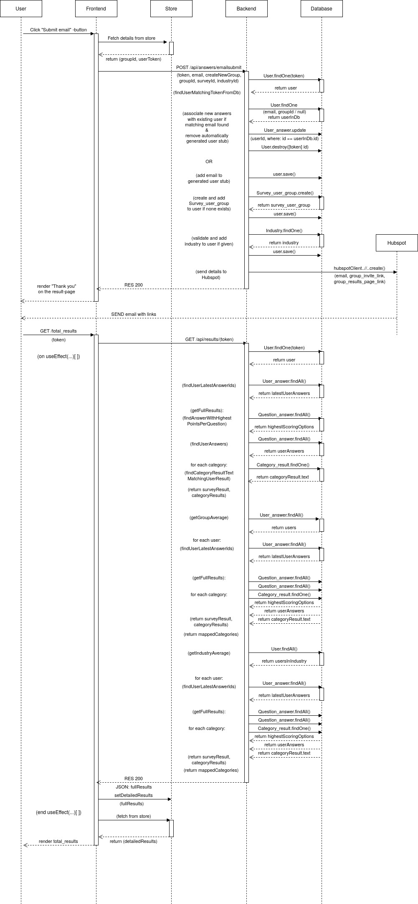

# Architecture

This application consists of three key components: Frontend, backend and a PostgreSQL database.

Frontend uses React and NextJS to provide a user interface to the application.
- Files in /pages have associated routes generated automatically
- Pages combine components and styling from /styles to create individual views, with the exeption of /survey/questions/index.jsx. It's content changes dynamically to provide the whole survey-section of the app.
- Services abstract connections to Backend. Axios is used to exchange data with Backend via HTTP.
- Store uses Zustand to save app state to local storage.

Backend uses Express to provide endpoints for frontend and Sequelize to interact with the database.
- Controllers receive requests and provide associated functionalities
- Helpers assist controllers with complex tasks
- Models and Config initialize and structure the database
- secrets are passed with the environment, for example with a .env-file.

During development a local PostgreSQL-database is used to store data.
In production, a similar database is used in Heroku.

## Communication between components

Communication between Frontend and Backend is done via HTTP-requests.
Backend interacts with the database with the assistance of Sequelize-library.

Communication in typical use-cases is described in the following sequence diagram.
NOTE: For brevity, only key traffic between frontend and store are described. Some details of backend-database requests are omitted for the same reason.

## Dependencies and external APIs

(Link to Backend API)
